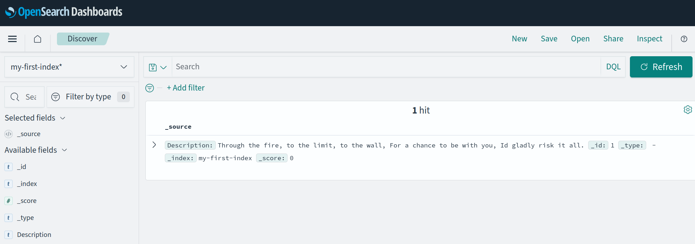
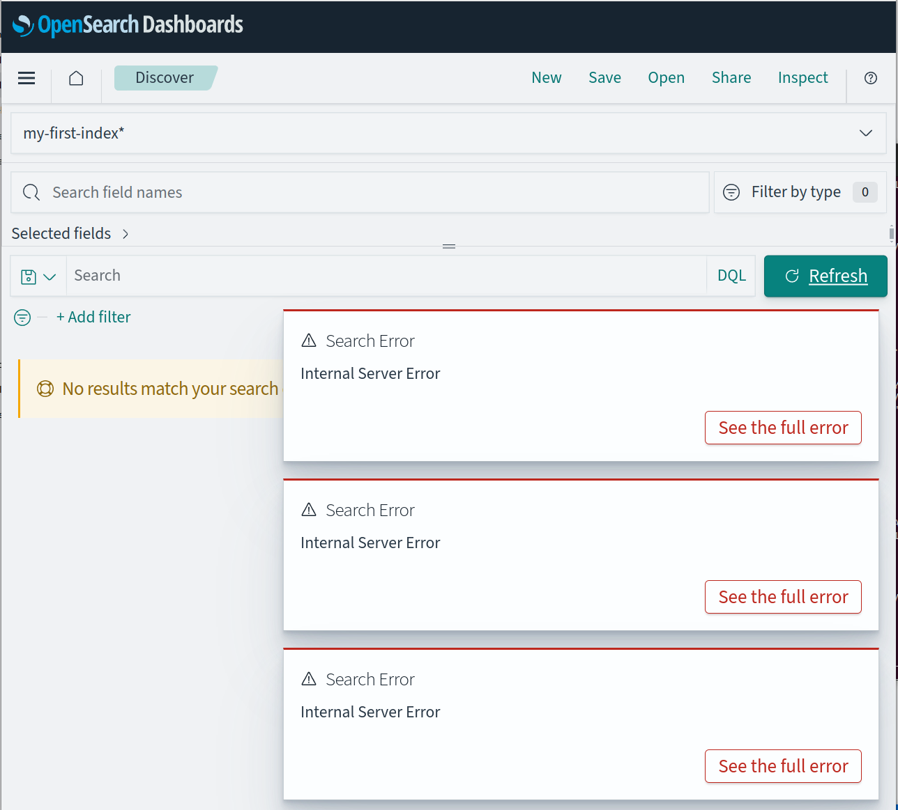
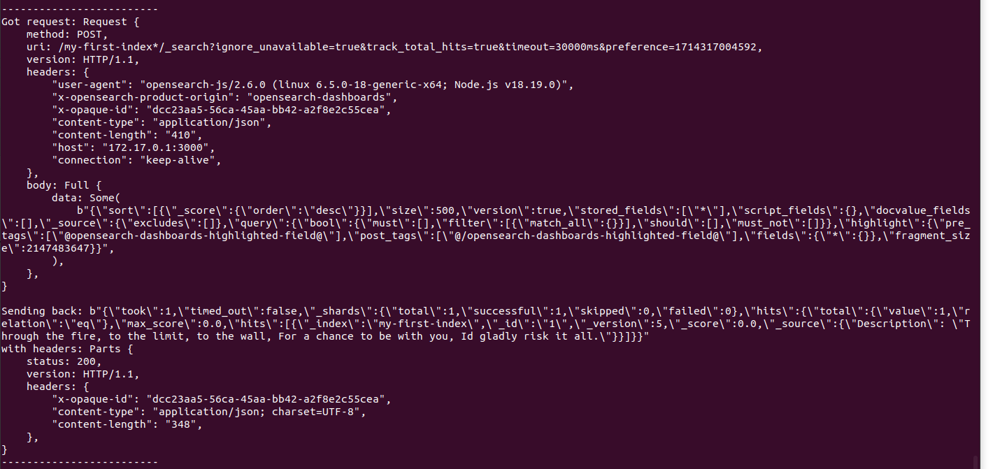
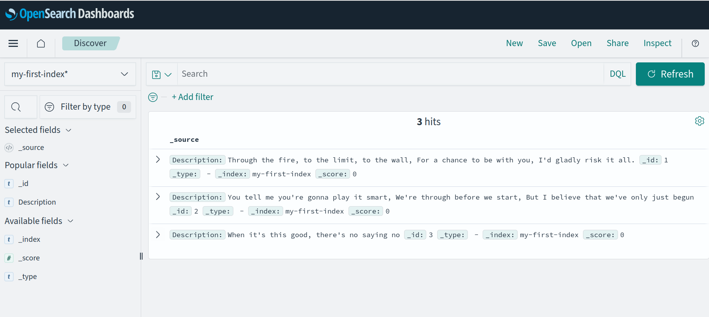

# tinyq????a

## Step 1 - initial research

Let's start our investigation by looking into what type of requests OpenSearch Dashboards (aka Kibana?) does to OpenSearch nodes (aka Elasticsearch nodes?) - capturing the traffic with Wireshark.
We'll start with the example [`docker-compose.yml` file from OpenSearch download page](https://opensearch.org/downloads.html):

```
wget https://opensearch.org/samples/docker-compose.yml
sudo sysctl -w vm.max_map_count=262144 
docker-compose up
```

Make sure to use Docker (and not Podman). I also modified the `docker-compose.yml` file to disable all security to make the research process easier.

Let's insert some example data:
```
curl -XPUT 'http://localhost:9200/my-first-index'
curl -XPUT 'http://localhost:9200/my-first-index/_doc/1' -H 'Content-Type: application/json' -d '{"Description": "Through the fire, to the limit, to the wall, For a chance to be with you, Id gladly risk it all."}'
```

This inserted document can then be queried in a "OpenSearch Dashboards > Discover" page:



Next, we use Wireshark to see the request that fetched this data (sent from OpenSearch dashboard container to OpenSearch node container):

```
[from dashboard to node]
POST /my-first-index*/_search?ignore_unavailable=true&track_total_hits=true&timeout=30000ms&preference=1714304044052 HTTP/1.1
user-agent: opensearch-js/2.6.0 (linux 6.5.0-18-generic-x64; Node.js v18.19.0)
x-opensearch-product-origin: opensearch-dashboards
x-opaque-id: 5c29ad7c-0505-47fb-8f3a-dcd40726744b
content-type: application/json
content-length: 410
Host: opensearch-node1:9200
Connection: keep-alive

{"sort":[{"_score":{"order":"desc"}}],"size":500,"version":true,"stored_fields":["*"],"script_fields":{},"docvalue_fields":[],"_source":{"excludes":[]},"query":{"bool":{"must":[],"filter":[{"match_all":{}}],"should":[],"must_not":[]}},"highlight":{"pre_tags":["@opensearch-dashboards-highlighted-field@"],"post_tags":["@/opensearch-dashboards-highlighted-field@"],"fields":{"*":{}},"fragment_size":2147483647}}

[from node to dashboard]
HTTP/1.1 200 OK
X-Opaque-Id: 5c29ad7c-0505-47fb-8f3a-dcd40726744b
content-type: application/json; charset=UTF-8
content-length: 348

{"took":1,"timed_out":false,"_shards":{"total":1,"successful":1,"skipped":0,"failed":0},"hits":{"total":{"value":1,"relation":"eq"},"max_score":0.0,"hits":[{"_index":"my-first-index","_id":"1","_version":5,"_score":0.0,"_source":{"Description": "Through the fire, to the limit, to the wall, For a chance to be with you, Id gladly risk it all."}}]}}
```

or as a curl command:
```
curl 'http://localhost:9200/my-first-index*/_search?ignore_unavailable=true&track_total_hits=true&timeout=30000ms&preference=1714304044052' \
 -X POST \
 -H 'user-agent: opensearch-js/2.6.0 (linux 6.5.0-18-generic-x64; Node.js v18.19.0)' \
 -H 'x-opensearch-product-origin: opensearch-dashboards' \
 -H 'x-opaque-id: 5c29ad7c-0505-47fb-8f3a-dcd40726744b' \
 -H 'content-type: application/json' \
 -H 'content-length: 410' \
 -H 'Host: opensearch-node1:9200' \
 -H 'Connection: keep-alive' \
 -d '{"sort":[{"_score":{"order":"desc"}}],"size":500,"version":true,"stored_fields":["*"],"script_fields":{},"docvalue_fields":[],"_source":{"excludes":[]},"query":{"bool":{"must":[],"filter":[{"match_all":{}}],"should":[],"must_not":[]}},"highlight":{"pre_tags":["@opensearch-dashboards-highlighted-field@"],"post_tags":["@/opensearch-dashboards-highlighted-field@"],"fields":{"*":{}},"fragment_size":2147483647}}'
```

Now let's see what types of auxilary requests the Dashboard performs - according to [KETCHUP project description](https://hydrolix.io/blog/ketchup-elastic-to-sql/#what-is-ketchup) we should expect many "read metadata" requests. Let's see all requests to the nodes that are required to render "OpenSearch Dashboards > Discover" page (sent from dashboard to node):

```
GET /.kibana/_doc/config%3A2.13.0
GET /.kibana/_doc/config%3A2.13.0
POST /.kibana/_search?size=10000&from=0&_source=index-pattern.title%2Cnamespace%2Cnamespaces%2Ctype%2Creferences%2CmigrationVersion%2Cupdated_at%2CoriginId%2Ctitle&rest_total_hits_as_int=true
POST /.kibana/_search?size=10000&from=0&_source=index-pattern.title%2Cnamespace%2Cnamespaces%2Ctype%2Creferences%2CmigrationVersion%2Cupdated_at%2CoriginId%2Ctitle&rest_total_hits_as_int=true
POST /_mget
GET /.kibana/_doc/config%3A2.13.0
```

## Step 2 - proxy

Inspired by [KETCHUP project](https://hydrolix.io/blog/ketchup-elastic-to-sql/#what-is-ketchup) we will set up a proxy between the dashboard and the node. At first the proxy will just forward all the requests to OpenSearch nodes, but over time it will be extended to translate some queries and send them to a different DB. We will write it in Rust and use the [`hyper`](https://github.com/hyperium/hyper) library. [`gateway.rs`](https://github.com/hyperium/hyper/blob/master/examples/gateway.rs) is a convenient starting point.

Additionally, we have to adjust `docker-compose.yml` file to use the default network (and be able to access the proxy started outside the Docker) and point `OPENSEARCH_HOSTS` to the proxy.

After relaunching all the nodes, we can validate that the OpenSearch Dashboard tries to use the proxy by purposefully forgetting to turn it on and expecting failures:



but once we turn on the proxy (`cd proxy; cargo run`) it correctly routes requests and the dashboard works as expected.



## Step 3 - hijacking requests

Now the fun part - let's handle some request on our own, without sending it to OpenSearch nodes. For now, we'll focus only on the most basic query - without any filtering and fallback to OpenSearch nodes otherwise.

The proxy code now will read the entire request and if it's a request to the `_search` endpoint it will try to parse and validate it.

If it's a query without any filtering (exact same query as seen above), the code will return a response with our own list of results (for now hardcoded in memory) - see it returning 3 hits instead of 1 hit:



In any other case, it will fall back to sending the request to the OpenSearch node. This way we can incrementally extend the compatibility.

